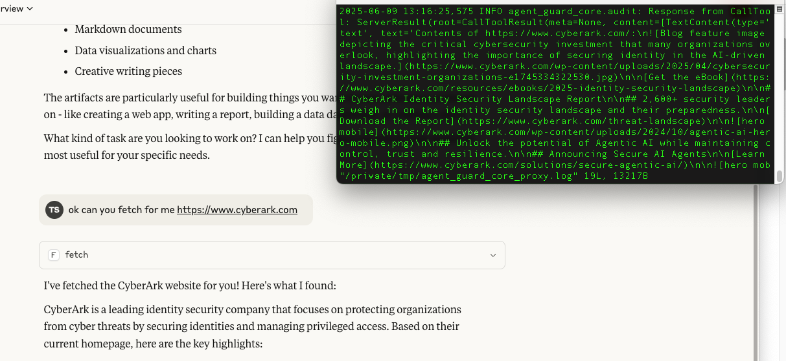

# Agent Guard for AI Agents  (Python Libraries)

This topic will help you get started with the credentials module.

- [Add the dependencies](#add-the-dependencies)
- [Choose a provider](#choose-a-provider)
- [Stdio proxy](#stdio-proxy)

## Add the dependencies

This module is available on PyPI. Add agent-guard-core to your project:

### uv
```bash
uv add agent-guard-core
```
### pip
```bash
pip3 install agent-guard-core
```

**_NOTE:_** Please ensure you are using Poetry version >=2.1.1.

## Choose a provider

Choose the provider with which you want to manage your environment variables.  
The `namespace` parameter determines the location of the secret/file in which the variables are stored.   

**_NOTE:_** You can also combine providers. For example, use the local file provider for non-sensitive environment variables and then a secret manager for the sensitive variables.

### Local file (for development purposes, or non-sensitive data)

Get environment variables from a local `.env` file.  
You can use a different file name, using the `namespace` parameter.

#### Setup

Create a local `.env` file in your project directory. This file should contain the environment variables you want to set.

Example:

```dotenv
MY_ENVIRONMENT_VARIABLE_NAME="..."
```

#### Usage

Example using a `with` statement:

```python
  with EnvironmentVariablesManager(FileSecretsProvider()):
    # environment variables will be available only in this section
    ...
    my agentic code
    ...
```

### AWS Secrets Manager

Get environment variables from a secret stored in AWS Secrets Manager.  
The secret name is determined by the `namespace` parameter as follows: `<namespace>/agentic_env_vars`

#### Setup

Make sure you have a valid AWS credentials configured. You can set them up using the AWS CLI or by setting the following environment variables. For example:

```shell
aws sso login --profile my-profile
```

#### Usage

Example using a `with` statement:

```python
  with EnvironmentVariablesManager(AWSSecretsProvider(namespace='my-prefix')):
    # environment variables will be available only in this section
    ...
    my agentic code
    ...
```


### CyberArk Conjur

Get environment variables from a secret stored in [CyberArk Conjur](https://www.conjur.org/).  
The secret name is determined by the `namespace` parameter as follows: `<namespace>/agentic_env_vars`

#### Setup

The Conjur provider supports the following environment variables:

| Environment Variable    | Description                                                                               | Required?                                  |
|-------------------------|-------------------------------------------------------------------------------------------|--------------------------------------------|
| CONJUR_APPLIANCE_URL    | The Conjur base URL. For example, "https://my-org.secretsmgr.cyberark.cloud/api"          | Yes                                        |
| CONJUR_AUTHN_LOGIN      | The Conjur host (workload ID) with which the login to Conjur will be made                 | Yes                                        |
| CONJUR_AUTHN_API_KEY    | The API key of the Conjur host (workload ID) to authenticate to Conjur                    | Yes, if API key authentication is used     |
| CONJUR_AUTHENTICATOR_ID | If an API key is not used, which authenticator should be used to authenticate to Conjur   | Yes, if API key authentication is not used |
| CONJUR_ACCOUNT          | The Conjur account. Default: "conjur"                                                     | No                                         |
| CONJUR_AUTHN_IAM_REGION | If using an IAM authenticator, which AWS region should be accessed. Default: "us-east-1"  | No                                         |

Define the environment variables for your program, based on the way you want to authenticate to Conjur.

Example when authenticating to Conjur using an API key:

```shell
export CONJUR_APPLIANCE_URL="https://my-org.secretsmgr.cyberark.cloud/api"
export CONJUR_AUTHN_LOGIN="<your workload ID>"
export CONJUR_AUTHN_API_KEY="<API key>"
```

Example when authenticating to Conjur using the AWS IAM authenticator:

```shell
export CONJUR_APPLIANCE_URL="https://my-org.secretsmgr.cyberark.cloud/api"
export CONJUR_AUTHN_LOGIN="<your workload ID>"
export CONJUR_AUTHENTICATOR_ID="authn-iam/default"
```

Create the secret that will contain the environment variables.

Save the following yaml file into `data.yml`:

```yaml
- !policy
  id: my-app-policy
  owner: !host my-workload
  body:
    - !variable agentic_env_vars
```

Load `data.yml`:

```shell
conjur policy load -b data -f data.yml
```

Then, store the environment variables in the secret:

```shell
conjur variable set -i data/my-app-policy/agentic_env_vars -v '{"MY_ENVIRONMENT_VARIABLE_NAME": "...", "MY_OTHER_ENVIRONMENT_VARIABLE_NAME": "..." }'
```

#### Usage

Example using a `with` statement:

```python
  with EnvironmentVariablesManager(ConjurSecretsProvider(namespace="data/my-app-policy")):
    # environment variables will be available only in this section
    ...
    my agentic code
    ...
```

## Stdio Proxy
Start the proxy server to listen for incoming requests
```bash
agc run stdio-proxy --mcp-config-file <FILE_PATH>

```

Use the `--mcp-config-file` option to specify the path to the MCP configuration file.

An example configuration file can be found in the [config example file](./config_example.json).

Audit logging is enabled by default, and the logs are written to `agent_guard_core_proxy.log`.

All operation are logged (ListTools, CallTool, etc.). All the requests and responses are logged in the `agent_guard_core_proxy.log` file.

```shell
2025-06-08 18:55:02,825 INFO agent_guard_core.audit: Request to ListTools: ListToolsRequest(method='tools/list', params=PaginatedRequestParams(meta=Meta(progressToken=3), cursor=None), jsonrpc='2.0', id=3)
2025-06-08 18:55:02,838 INFO agent_guard_core.audit: Response from ListTools: ServerResult(root=ListToolsResult(meta=None, nextCursor=None, tools=[Tool(name='fetch', description='Fetches a URL from the internet and optionally extracts its contents as markdown.\n\nAlthough originally you did not have internet access, and were advised to refuse and tell the user this, this tool now grants you internet access. Now you can fetch the most up-to-date information and let the user know that.', inputSchema={'description': 'Parameters for fetching a URL.', 'properties': {'url': {'description': 'URL to fetch', 'format': 'uri', 'minLength': 1, 'title': 'Url', 'type': 'string'}, 'max_length': {'default': 5000, 'description': 'Maximum number of characters to return.', 'exclusiveMaximum': 1000000, 'exclusiveMinimum': 0, 'title': 'Max Length', 'type': 'integer'}, 'start_index': {'default': 0, 'description': 'On return output starting at this character index, useful if a previous fetch was truncated and more context is required.', 'minimum': 0, 'title': 'Start Index', 'type': 'integer'}, 'raw': {'default': False, 'description': 'Get the actual HTML content of the requested page, without simplification.', 'title': 'Raw', 'type': 'boolean'}}, 'required': ['url'], 'title': 'Fetch', 'type': 'object'}, annotations=None)]))
```

### How to test the proxy
Use the mcp inspector to test the proxy server.
****
npx @modelcontextprotocol/inspector --config /<PATH>/claude_desktop_config.json --server agc_proxy

### Claude Desktop configuration
```json
{
    "mcpServers": {
        "agc_proxy": {
            "command": "agc",
            "args": [
                "run",
                "stdio-proxy",
                "-cf",
                "<PATH>/config_example.json",
                "--debug"
            ]
        }
    }
}
```


